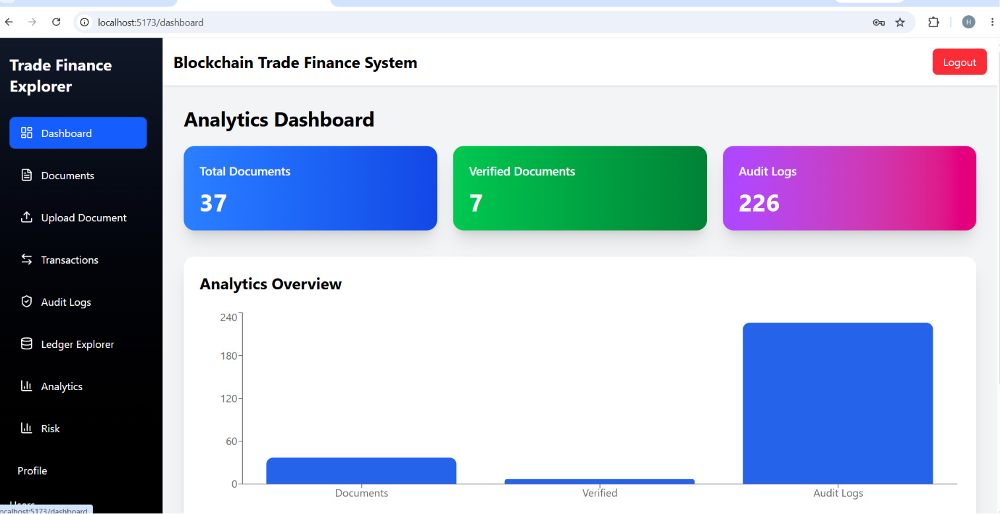
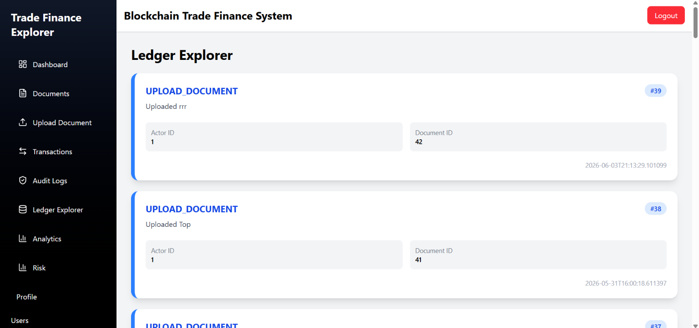
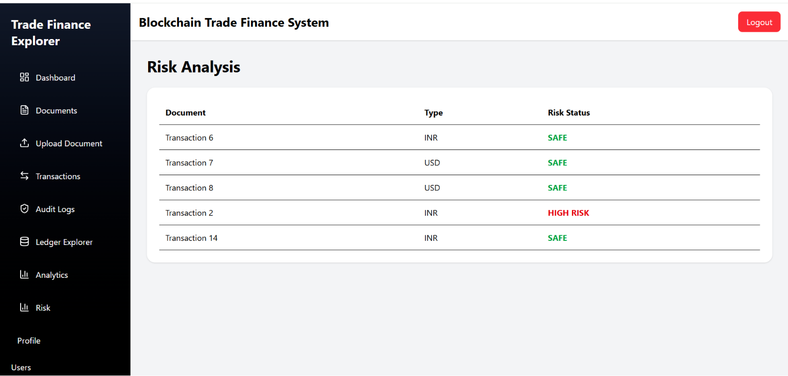
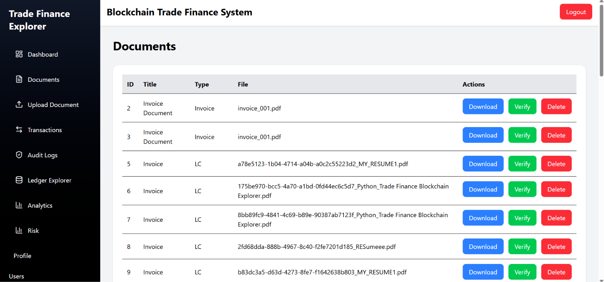
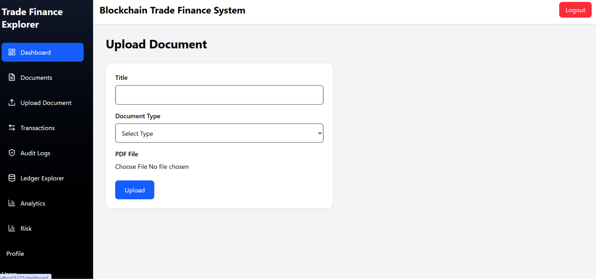
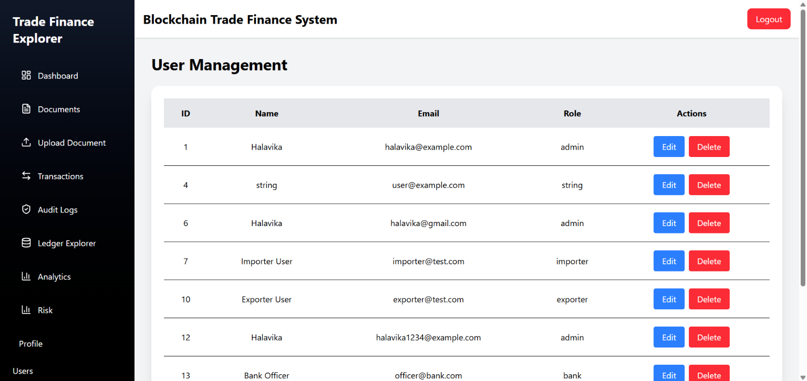
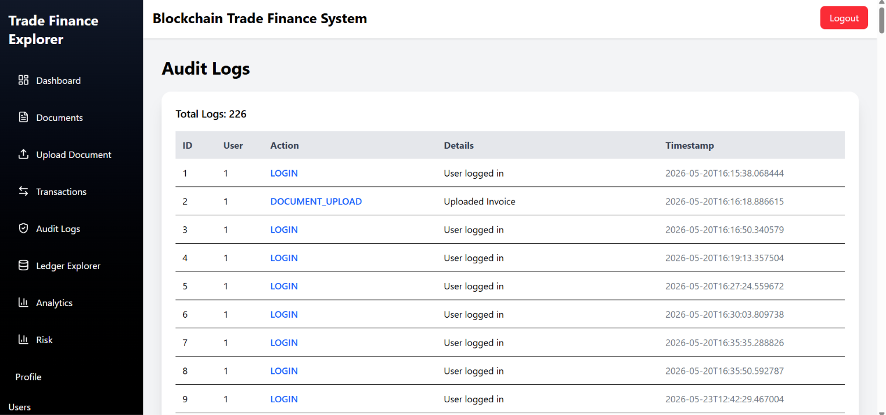

<div align="center">

# 🚀 Trade Finance Blockchain Explorer

### Blockchain-Inspired Trade Finance Management System

Secure • Transparent • Tamper-Evident • Analytics-Driven

</div>

---

## 📌 Overview

Trade Finance Blockchain Explorer is a full-stack enterprise-style application designed to provide secure and transparent tracking of trade documents, transactions, and audit logs.

The platform uses a **blockchain-inspired immutable ledger architecture** with cryptographic hashing to ensure integrity, traceability, and tamper-evident financial operations.

---

# ✨ Features

## 🔐 Authentication & Authorization

✔ JWT-based authentication
✔ Role-based access control (Admin/User)
✔ Protected frontend and backend routes

---

## 📄 Document Management

✔ Upload and manage trade documents
✔ SHA-256 file hashing for integrity verification
✔ Secure backend storage system

---

## 📊 Ledger Explorer

✔ Immutable ledger-style transaction tracking
✔ Chronological event logging
✔ Buyer/Seller/System activity tracking
✔ Full trade traceability

---

## 💰 Transaction Management

✔ Create and monitor trade transactions
✔ Transaction lifecycle management

```text
Pending → Verified → Completed
```

---

## ⚠️ Risk Engine

✔ Rule-based risk scoring
✔ Risk classification system
✔ High-risk transaction detection

---

## 📈 Analytics Dashboard

✔ Interactive analytics with Recharts
✔ Verification status metrics
✔ Audit activity visualization
✔ Document distribution insights

---

## 📤 Export System

✔ Export reports to PDF
✔ Export analytics to Excel
✔ Business reporting support

---

# 🏗️ System Architecture

```text
Frontend (React + Vite)
        ↓
Backend (FastAPI)
        ↓
PostgreSQL Database
        ↓
Service Layer
   ├── JWT Authentication
   ├── Ledger Service
   ├── Risk Engine
   ├── Hashing Service
   ├── Export Service
```

---

# 🛠️ Tech Stack

## Frontend

* React.js
* Vite
* Axios
* Recharts
* Tailwind CSS

## Backend

* FastAPI
* SQLAlchemy ORM
* JWT Authentication
* Pydantic Validation

## Database

* PostgreSQL

## Tools & Libraries

* SHA-256 Hashing
* jsPDF
* XLSX
* Pandas

---

# 📸 Application Screenshots

## 🏠 Dashboard



---

## 📊 Analytics Dashboard


---

## 📜 Ledger Explorer



---

## ⚠️ Risk Analysis



---

## 📄 Documents Module



---

## 📤 Upload Module



---

## 👤 Users Management



---

## 📜 Audit Logs



---

# 🧠 Core Concept

This project implements a:

> **Blockchain-inspired immutable ledger system** using cryptographic hashing and structured event logs to provide tamper-evident trade finance tracking.

---

# ⚙️ Installation & Setup

## Backend Setup

```bash
pip install -r requirements.txt
uvicorn app.main:app --reload
```

---

## Frontend Setup

```bash
npm install
npm run dev
```

---

# 📂 Project Structure

```text
trade-finance-blockchain-explorer/
│
├── frontend/
├── backend/
├── assets/
└── README.md
```

---

# 👨‍💻 Author

### Halavika Palle

Final Year CSE Student

---

<div align="center">

### ⭐ If you like this project, consider giving it a star ⭐

</div>
